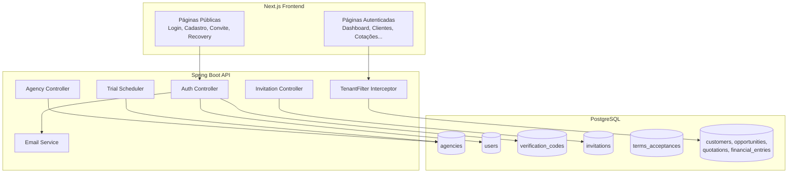
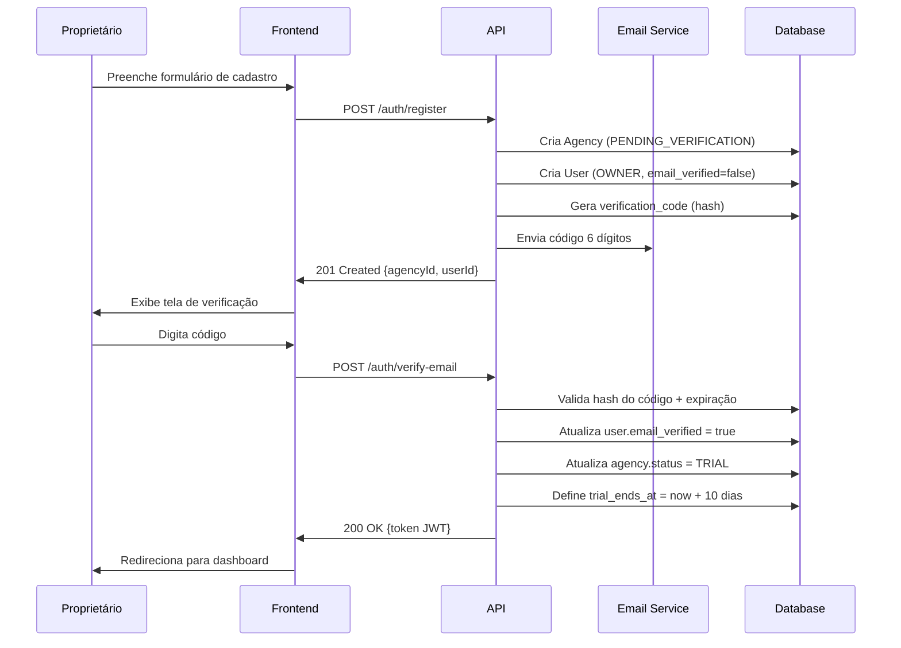
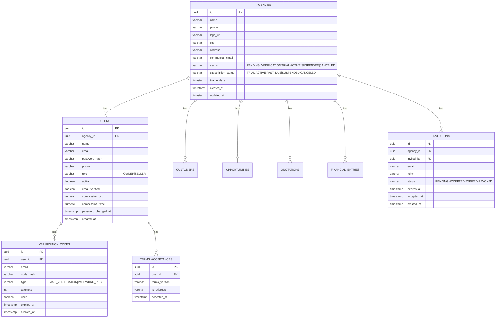

# Design — Onboarding de Agência, Multi-Tenancy e Autenticação

## Visão Geral

Este documento descreve o design técnico para transformar o AgenciaHub de uma aplicação single-tenant em multi-tenant. A mudança é estrutural: introduz a entidade `Agency` como raiz de isolamento de dados, adiciona fluxos de cadastro self-service com verificação por e-mail, convite de vendedores por token, recuperação/alteração de senha, aceite de termos de uso, trial de 10 dias e controle de permissões OWNER/SELLER.

### Decisões Arquiteturais Principais

| Decisão | Escolha | Justificativa |
|---------|---------|---------------|
| Estratégia de multi-tenancy | Coluna `agency_id` (shared database) | Simplicidade operacional; escala suficiente para o estágio atual |
| Filtro de tenant | Interceptor Spring + claim JWT | Garante isolamento sem depender do desenvolvedor lembrar de filtrar |
| Verificação de e-mail | Código 6 dígitos (não link) | UX mobile-friendly; evita problemas com proxies de e-mail |
| Armazenamento de código | BCrypt hash | Segurança: código não fica em texto plano no banco |
| Token de convite | UUID v4 na URL | Simples, não-adivinhável, sem estado no cliente |
| Invalidação de sessão | Campo `password_changed_at` no JWT | Permite invalidar tokens sem blacklist |
| E-mail service | Interface abstrata + **Resend** (HTTPS) | Padrão em produção e em Railway Hobby (SMTP bloqueado); SMTP opcional em Pro+ |
| Trial | 10 dias, scheduler verifica expiração | Simples; job diário atualiza status |

### Diagrama de Contexto



---

## Arquitetura

### Camadas do Backend

```
┌─────────────────────────────────────────────────────┐
│  Controller Layer (REST endpoints)                   │
├─────────────────────────────────────────────────────┤
│  Service Layer (business logic)                      │
├─────────────────────────────────────────────────────┤
│  Security Layer (JWT + TenantContext)                │
├─────────────────────────────────────────────────────┤
│  Repository Layer (JPA + tenant filtering)           │
├─────────────────────────────────────────────────────┤
│  Database (PostgreSQL + Flyway migrations)           │
└─────────────────────────────────────────────────────┘
```

### Fluxo de Multi-Tenancy

1. Usuário faz login → JWT gerado com `agency_id` no payload
2. Cada request autenticada passa pelo `JwtAuthFilter`
3. Filter extrai `agency_id` do token e armazena no `TenantContext` (ThreadLocal)
4. Repositories adicionam `WHERE agency_id = :tenantId` em todas as queries
5. Ao final da request, `TenantContext` é limpo

### Fluxo de Cadastro de Agência



---

## Componentes e Interfaces

### Novos Pacotes Backend

```
com.agenciahub.api/
├── config/
│   ├── TenantInterceptorConfig.java
│   └── MailDispatchConfiguration.java
├── controller/
│   ├── AgencyController.java
│   └── InvitationController.java
├── domain/
│   ├── AgencyStatus.java
│   ├── SubscriptionStatus.java
│   ├── InvitationStatus.java
│   └── VerificationCodeType.java
├── dto/
│   ├── agency/
│   │   ├── RegisterAgencyRequest.java
│   │   ├── AgencyResponse.java
│   │   └── UpdateAgencyRequest.java
│   ├── auth/
│   │   ├── VerifyEmailRequest.java
│   │   ├── ResendCodeRequest.java
│   │   ├── ForgotPasswordRequest.java
│   │   ├── ResetPasswordRequest.java
│   │   ├── ChangePasswordRequest.java
│   │   └── RegisterViaInviteRequest.java
│   └── invitation/
│       ├── CreateInvitationRequest.java
│       └── InvitationResponse.java
├── entity/
│   ├── Agency.java
│   ├── Invitation.java
│   ├── VerificationCode.java
│   └── TermsAcceptance.java
├── repository/
│   ├── AgencyRepository.java
│   ├── InvitationRepository.java
│   ├── VerificationCodeRepository.java
│   └── TermsAcceptanceRepository.java
├── security/
│   └── TenantContext.java
├── service/
│   ├── AgencyService.java
│   ├── InvitationService.java
│   ├── VerificationCodeService.java
│   ├── EmailService.java (interface)
│   └── email/
│       ├── TransactionalMail.java
│       ├── TransactionalMailBody.java
│       ├── TransactionalMailChannel.java
│       └── DefaultEmailService.java
└── validation/
    └── PhoneValidator.java
```

### API Endpoints

#### Autenticação (Públicos)

| Método | Rota | Descrição |
|--------|------|-----------|
| POST | `/auth/register` | Cadastro de nova agência + proprietário |
| POST | `/auth/verify-email` | Verificação de e-mail com código 6 dígitos |
| POST | `/auth/resend-code` | Reenvio de código de verificação |
| POST | `/auth/login` | Login (existente, modificado para incluir agency_id) |
| POST | `/auth/forgot-password` | Solicita recuperação de senha |
| POST | `/auth/reset-password` | Redefine senha com código |
| GET | `/auth/invite/{token}` | Valida token de convite e retorna dados |
| POST | `/auth/register-invite` | Cadastro de vendedor via convite |

#### Autenticação (Autenticados)

| Método | Rota | Descrição |
|--------|------|-----------|
| POST | `/auth/change-password` | Alteração de senha (requer senha atual) |

#### Agência (Autenticados — OWNER only)

| Método | Rota | Descrição |
|--------|------|-----------|
| GET | `/agency` | Dados da agência do usuário |
| PATCH | `/agency` | Atualiza dados da agência |
| POST | `/agency/logo` | Upload de logotipo |

#### Convites (Autenticados — OWNER only)

| Método | Rota | Descrição |
|--------|------|-----------|
| POST | `/invitations` | Cria convite para vendedor |
| GET | `/invitations` | Lista convites da agência |
| DELETE | `/invitations/{id}` | Revoga convite pendente |

#### Termos (Público + Autenticado)

| Método | Rota | Descrição |
|--------|------|-----------|
| GET | `/public/terms/latest` | Retorna versão atual dos termos |
| POST | `/terms/accept` | Registra aceite dos termos (autenticado) |

### Contratos de Request/Response

#### POST /auth/register

```json
// Request
{
  "agencyName": "Viagens Fantásticas",
  "ownerName": "João Silva",
  "email": "joao@viagens.com",
  "password": "senhaSegura123",
  "passwordConfirmation": "senhaSegura123",
  "ownerPhone": "5511999887766",
  "agencyPhone": "551133445566",  // opcional
  "termsAccepted": true,
  "termsVersion": "1.0.0"
}

// Response 201
{
  "agencyId": "uuid",
  "userId": "uuid",
  "message": "Código de verificação enviado para joao@viagens.com"
}
```

#### POST /auth/verify-email

```json
// Request
{
  "email": "joao@viagens.com",
  "code": "482917"
}

// Response 200
{
  "token": "eyJhbGciOiJIUzI1NiJ9...",
  "userId": "uuid",
  "name": "João Silva",
  "email": "joao@viagens.com",
  "role": "OWNER",
  "agencyId": "uuid",
  "agencyName": "Viagens Fantásticas"
}
```

#### POST /auth/login (modificado)

```json
// Response 200 (campos adicionados)
{
  "token": "eyJhbGciOiJIUzI1NiJ9...",
  "userId": "uuid",
  "name": "João Silva",
  "email": "joao@viagens.com",
  "role": "OWNER",
  "agencyId": "uuid",
  "agencyName": "Viagens Fantásticas",
  "agencyStatus": "TRIAL",
  "trialEndsAt": "2025-02-15T00:00:00Z"
}
```

#### POST /invitations

```json
// Request
{
  "email": "vendedor@email.com"
}

// Response 201
{
  "id": "uuid",
  "email": "vendedor@email.com",
  "token": "uuid-token",
  "inviteUrl": "https://app.agenciahub.com/convite/uuid-token",
  "expiresAt": "2025-02-08T14:30:00Z",
  "status": "PENDING"
}
```

---

## Modelos de Dados

### Diagrama ER



### Migração V9 — Multi-Tenancy (Nova)

```sql
-- V9__multi_tenancy_agencies.sql

-- 1. Tabela de agências
CREATE TABLE agencies (
    id                  UUID         NOT NULL PRIMARY KEY,
    name                VARCHAR(255) NOT NULL,
    phone               VARCHAR(32),
    logo_url            VARCHAR(1024),
    cnpj                VARCHAR(18),
    address             TEXT,
    commercial_email    VARCHAR(320),
    status              VARCHAR(32)  NOT NULL DEFAULT 'PENDING_VERIFICATION',
    subscription_status VARCHAR(32)  NOT NULL DEFAULT 'TRIAL',
    trial_ends_at       TIMESTAMP WITH TIME ZONE,
    created_at          TIMESTAMP WITH TIME ZONE NOT NULL DEFAULT NOW(),
    updated_at          TIMESTAMP WITH TIME ZONE NOT NULL DEFAULT NOW()
);

CREATE INDEX idx_agencies_status ON agencies (status);

-- 2. Adicionar agency_id na tabela users
ALTER TABLE users ADD COLUMN agency_id UUID REFERENCES agencies (id);
ALTER TABLE users ADD COLUMN phone VARCHAR(32);
ALTER TABLE users ADD COLUMN email_verified BOOLEAN NOT NULL DEFAULT FALSE;
ALTER TABLE users ADD COLUMN password_changed_at TIMESTAMP WITH TIME ZONE;

-- 3. Adicionar agency_id nas tabelas existentes
ALTER TABLE customers ADD COLUMN agency_id UUID REFERENCES agencies (id);
ALTER TABLE opportunities ADD COLUMN agency_id UUID REFERENCES agencies (id);
ALTER TABLE quotations ADD COLUMN agency_id UUID REFERENCES agencies (id);
ALTER TABLE financial_entries ADD COLUMN agency_id UUID REFERENCES agencies (id);

-- 4. Criar agência padrão para dados existentes
INSERT INTO agencies (id, name, status, subscription_status, created_at, updated_at)
VALUES (
    'a0000000-0000-0000-0000-000000000000',
    'Agência Padrão (Migração)',
    'ACTIVE',
    'ACTIVE',
    NOW(),
    NOW()
);

-- 5. Vincular dados existentes à agência padrão
UPDATE users SET agency_id = 'a0000000-0000-0000-0000-000000000000', email_verified = TRUE
WHERE agency_id IS NULL;

UPDATE customers SET agency_id = 'a0000000-0000-0000-0000-000000000000'
WHERE agency_id IS NULL;

UPDATE opportunities SET agency_id = 'a0000000-0000-0000-0000-000000000000'
WHERE agency_id IS NULL;

UPDATE quotations SET agency_id = 'a0000000-0000-0000-0000-000000000000'
WHERE agency_id IS NULL;

UPDATE financial_entries SET agency_id = 'a0000000-0000-0000-0000-000000000000'
WHERE agency_id IS NULL;

-- 6. Tornar agency_id NOT NULL após migração de dados
ALTER TABLE users ALTER COLUMN agency_id SET NOT NULL;
ALTER TABLE customers ALTER COLUMN agency_id SET NOT NULL;
ALTER TABLE opportunities ALTER COLUMN agency_id SET NOT NULL;
ALTER TABLE quotations ALTER COLUMN agency_id SET NOT NULL;
ALTER TABLE financial_entries ALTER COLUMN agency_id SET NOT NULL;

-- 7. Índices para multi-tenancy
CREATE INDEX idx_users_agency_id ON users (agency_id);
CREATE INDEX idx_customers_agency_id ON customers (agency_id);
CREATE INDEX idx_opportunities_agency_id ON opportunities (agency_id);
CREATE INDEX idx_quotations_agency_id ON quotations (agency_id);
CREATE INDEX idx_financial_entries_agency_id ON financial_entries (agency_id);

-- 8. Tabela de convites
CREATE TABLE invitations (
    id          UUID         NOT NULL PRIMARY KEY,
    agency_id   UUID         NOT NULL REFERENCES agencies (id),
    invited_by  UUID         NOT NULL REFERENCES users (id),
    email       VARCHAR(320) NOT NULL,
    token       VARCHAR(255) NOT NULL UNIQUE,
    status      VARCHAR(16)  NOT NULL DEFAULT 'PENDING',
    expires_at  TIMESTAMP WITH TIME ZONE NOT NULL,
    accepted_at TIMESTAMP WITH TIME ZONE,
    created_at  TIMESTAMP WITH TIME ZONE NOT NULL DEFAULT NOW()
);

CREATE INDEX idx_invitations_token ON invitations (token);
CREATE INDEX idx_invitations_agency_id ON invitations (agency_id);
CREATE INDEX idx_invitations_email ON invitations (email);

-- 9. Tabela de códigos de verificação
CREATE TABLE verification_codes (
    id          UUID         NOT NULL PRIMARY KEY,
    user_id     UUID         REFERENCES users (id),
    email       VARCHAR(320) NOT NULL,
    code_hash   VARCHAR(255) NOT NULL,
    type        VARCHAR(32)  NOT NULL,
    attempts    INT          NOT NULL DEFAULT 0,
    used        BOOLEAN      NOT NULL DEFAULT FALSE,
    expires_at  TIMESTAMP WITH TIME ZONE NOT NULL,
    created_at  TIMESTAMP WITH TIME ZONE NOT NULL DEFAULT NOW()
);

CREATE INDEX idx_verification_codes_email ON verification_codes (email);
CREATE INDEX idx_verification_codes_user_id ON verification_codes (user_id);

-- 10. Tabela de aceite de termos
CREATE TABLE terms_acceptances (
    id             UUID         NOT NULL PRIMARY KEY,
    user_id        UUID         NOT NULL REFERENCES users (id),
    terms_version  VARCHAR(32)  NOT NULL,
    ip_address     VARCHAR(45),
    accepted_at    TIMESTAMP WITH TIME ZONE NOT NULL DEFAULT NOW()
);

CREATE INDEX idx_terms_acceptances_user_id ON terms_acceptances (user_id);

-- 11. Tabela de log de auditoria da agência
CREATE TABLE agency_audit_log (
    id          UUID         NOT NULL PRIMARY KEY,
    agency_id   UUID         NOT NULL REFERENCES agencies (id),
    user_id     UUID         NOT NULL REFERENCES users (id),
    action      VARCHAR(64)  NOT NULL,
    field_name  VARCHAR(128),
    old_value   TEXT,
    new_value   TEXT,
    created_at  TIMESTAMP WITH TIME ZONE NOT NULL DEFAULT NOW()
);

CREATE INDEX idx_agency_audit_log_agency_id ON agency_audit_log (agency_id);
```

### Alterações nas Entidades Java

#### Nova Entidade: Agency

```java
@Entity
@Table(name = "agencies")
public class Agency {
    @Id @GeneratedValue(strategy = GenerationType.UUID)
    private UUID id;
    private String name;
    private String phone;
    private String logoUrl;
    private String cnpj;
    private String address;
    private String commercialEmail;

    @Enumerated(EnumType.STRING)
    private AgencyStatus status;

    @Enumerated(EnumType.STRING)
    private SubscriptionStatus subscriptionStatus;

    private Instant trialEndsAt;
    private Instant createdAt;
    private Instant updatedAt;
}
```

#### Entidade User (Modificada)

Campos adicionados:
- `UUID agencyId` — FK para agencies
- `String phone` — telefone/WhatsApp
- `Boolean emailVerified` — flag de verificação
- `Instant passwordChangedAt` — para invalidação de tokens

#### TenantContext (ThreadLocal)

```java
public class TenantContext {
    private static final ThreadLocal<UUID> currentTenant = new ThreadLocal<>();

    public static void set(UUID agencyId) { currentTenant.set(agencyId); }
    public static UUID get() { return currentTenant.get(); }
    public static void clear() { currentTenant.remove(); }
}
```

### JWT Payload (Modificado)

```json
{
  "sub": "user-uuid",
  "role": "OWNER",
  "agency_id": "agency-uuid",
  "password_changed_at": 1706745600,
  "iat": 1706832000,
  "exp": 1706918400
}
```

O campo `password_changed_at` permite invalidar tokens emitidos antes de uma troca de senha sem manter blacklist.

---

## Propriedades de Corretude

*Uma propriedade é uma característica ou comportamento que deve ser verdadeiro em todas as execuções válidas de um sistema — essencialmente, uma declaração formal sobre o que o sistema deve fazer. Propriedades servem como ponte entre especificações legíveis por humanos e garantias de corretude verificáveis por máquina.*


### Property 1: Round-trip de código de verificação

*Para qualquer* código de 6 dígitos gerado pelo sistema, armazená-lo como hash e depois verificar o código original contra esse hash deve retornar sucesso. Verificar qualquer outro código de 6 dígitos diferente deve retornar falha.

**Validates: Requirements 1.3, 3.6, 6.2, 8.1, 8.2**

### Property 2: Unicidade de e-mail

*Para qualquer* e-mail já cadastrado no sistema, uma tentativa de registro (seja de agência ou vendedor) com o mesmo e-mail deve ser rejeitada, independentemente de capitalização ou espaços.

**Validates: Requirements 1.4, 4.3**

### Property 3: Rejeição de código inválido ou expirado

*Para qualquer* código de verificação que não corresponda ao hash armazenado, ou cujo timestamp de criação exceda 15 minutos, a verificação deve falhar e a operação associada (ativação, reset de senha) não deve ser executada.

**Validates: Requirements 1.5, 6.4, 8.3**

### Property 4: Validação de comprimento mínimo de senha

*Para qualquer* string com menos de 8 caracteres, o sistema deve rejeitar a operação (cadastro, alteração de senha, reset de senha). Para qualquer string com 8 ou mais caracteres, a validação de comprimento deve passar.

**Validates: Requirements 1.6, 6.6, 7.3**

### Property 5: Novo código invalida anteriores

*Para qualquer* e-mail com um código de verificação ativo, quando um novo código é gerado para o mesmo e-mail, o código anterior deve se tornar inválido (mesmo que ainda esteja dentro do prazo de expiração).

**Validates: Requirements 1.7, 8.4**

### Property 6: Isolamento de dados por tenant

*Para qualquer* consulta de dados (clientes, oportunidades, cotações, entradas financeiras) feita por um usuário autenticado, todos os resultados retornados devem pertencer exclusivamente à agência do usuário. Nenhum registro de outra agência deve aparecer nos resultados.

**Validates: Requirements 2.2, 2.3**

### Property 7: Acesso cross-tenant retorna 403

*Para qualquer* recurso pertencente a uma agência B, quando um usuário da agência A tenta acessá-lo diretamente (por ID), o sistema deve retornar HTTP 403 Forbidden.

**Validates: Requirements 2.4**

### Property 8: JWT contém agency_id válido

*Para qualquer* login bem-sucedido, o token JWT gerado deve conter as claims `sub` (user_id), `role`, `agency_id` e `password_changed_at`, onde `agency_id` corresponde à agência do usuário no banco de dados.

**Validates: Requirements 5.1, 5.5**

### Property 9: Conta não verificada ou inativa impede login

*Para qualquer* usuário com `email_verified = false` ou `active = false`, uma tentativa de login com credenciais corretas deve ser rejeitada com mensagem apropriada.

**Validates: Requirements 5.3, 5.4**

### Property 10: Token de convite expirado ou usado é rejeitado

*Para qualquer* token de convite com `expires_at` no passado (mais de 72h) ou com `status = ACCEPTED/REVOKED`, uma tentativa de cadastro via esse token deve ser rejeitada.

**Validates: Requirements 3.7, 3.8, 3.10**

### Property 11: Convite cria vendedor na agência correta

*Para qualquer* token de convite válido vinculado a uma agência X, quando um vendedor completa o cadastro via esse convite, o vendedor criado deve ter `agency_id = X` e `role = SELLER`.

**Validates: Requirements 3.5**

### Property 12: Alteração de senha invalida tokens anteriores

*Para qualquer* usuário que altera sua senha com sucesso, todos os tokens JWT emitidos antes da alteração (com `password_changed_at` anterior ao novo valor) devem ser rejeitados pelo sistema.

**Validates: Requirements 7.4**

### Property 13: Cadastro sem aceite de termos é rejeitado

*Para qualquer* requisição de cadastro onde `termsAccepted = false` ou ausente, o sistema deve rejeitar o cadastro com erro de validação.

**Validates: Requirements 11.2**

### Property 14: Validação de formato de telefone brasileiro

*Para qualquer* string de telefone, o sistema deve aceitar apenas números com 10 dígitos (fixo com DDD) ou 11 dígitos (celular com DDD). Qualquer outro formato deve ser rejeitado.

**Validates: Requirements 13.3, 13.4**

### Property 15: Máquina de estados de assinatura

*Para qualquer* transição de `SubscriptionStatus`, apenas as seguintes transições são válidas: TRIAL→ACTIVE, TRIAL→SUSPENDED, ACTIVE→PAST_DUE, ACTIVE→CANCELED, PAST_DUE→ACTIVE, PAST_DUE→SUSPENDED, SUSPENDED→ACTIVE, SUSPENDED→CANCELED. Qualquer outra transição deve ser rejeitada.

**Validates: Requirements 14.1, 14.3, 14.5, 14.6, 14.7, 14.8, 16.1-16.5**

### Property 16: Enforcement de permissões OWNER/SELLER

*Para qualquer* endpoint restrito ao OWNER (financeiro, exportação de clientes, gestão de vendedores), uma requisição autenticada com role SELLER deve retornar HTTP 403. Para endpoints permitidos ao SELLER, a requisição deve ser processada normalmente.

**Validates: Requirements 15.2, 15.3, 15.4, 15.9**

### Property 17: Confirmação de senha deve coincidir

*Para qualquer* par de strings (password, passwordConfirmation) onde `password != passwordConfirmation`, o sistema deve rejeitar a operação de cadastro tanto no frontend quanto no backend.

**Validates: Requirements 12.2, 12.4, 12.5, 12.6**

### Property 18: Não-divulgação de informação em recuperação de senha

*Para qualquer* e-mail submetido na recuperação de senha (existente ou não no sistema), a resposta HTTP deve ser idêntica (mesmo status code, mesma estrutura de body), impedindo enumeração de e-mails.

**Validates: Requirements 6.3**

---

## Tratamento de Erros

### Códigos HTTP e Mensagens

| Cenário | HTTP Status | Mensagem |
|---------|-------------|----------|
| E-mail já cadastrado | 409 Conflict | "Este e-mail já está cadastrado" |
| Código de verificação inválido | 400 Bad Request | "Código inválido ou expirado" |
| Código expirado | 400 Bad Request | "Código inválido ou expirado" |
| Limite de tentativas excedido | 429 Too Many Requests | "Muitas tentativas. Solicite um novo código" |
| Rate limit de reenvio | 429 Too Many Requests | "Limite de reenvios atingido. Tente novamente em X minutos" |
| Token de convite expirado | 410 Gone | "Este convite expirou" |
| Token de convite já usado | 410 Gone | "Este convite já foi utilizado" |
| Token de convite revogado | 410 Gone | "Este convite foi cancelado" |
| Credenciais inválidas | 401 Unauthorized | "Credenciais inválidas" |
| Conta não verificada | 403 Forbidden | "Verifique seu e-mail para acessar o sistema" |
| Agência suspensa | 403 Forbidden | "Sua agência está suspensa. Entre em contato com o suporte" |
| Acesso cross-tenant | 403 Forbidden | "Acesso negado" |
| Permissão insuficiente (SELLER) | 403 Forbidden | "Você não tem permissão para esta ação" |
| Senha atual incorreta | 400 Bad Request | "Senha atual incorreta" |
| Senhas não coincidem | 400 Bad Request | "As senhas não coincidem" |
| Senha muito curta | 400 Bad Request | "A senha deve ter no mínimo 8 caracteres" |
| Telefone formato inválido | 400 Bad Request | "Formato de telefone inválido. Use DDD + número" |
| CNPJ inválido | 400 Bad Request | "CNPJ inválido" |
| Logo muito grande | 400 Bad Request | "Imagem deve ter no máximo 2MB" |
| Formato de logo inválido | 400 Bad Request | "Formatos aceitos: PNG, JPG, SVG" |
| Termos não aceitos | 400 Bad Request | "É necessário aceitar os Termos de Uso" |
| Recuperação de senha (e-mail não existe) | 200 OK | "Se o e-mail estiver cadastrado, você receberá um código" |

### Estratégia de Rate Limiting

- **Verificação de código**: 5 tentativas por código gerado. Após 5 erros, código é invalidado.
- **Reenvio de código**: 5 reenvios por hora por e-mail.
- **Recuperação de senha**: 5 solicitações por hora por e-mail.
- Implementação via contador no banco (`verification_codes.attempts`) e query com `created_at > NOW() - INTERVAL '1 hour'`.

### Tratamento de Falhas de E-mail

- Se o envio de e-mail falhar, o cadastro ainda é criado (o código fica no banco).
- O usuário pode solicitar reenvio.
- Logs de erro são registrados para monitoramento.
- Retry automático com backoff exponencial (3 tentativas).

---

## Estratégia de Testes

### Abordagem Dual

1. **Testes de Propriedade (Property-Based Testing)**: Validam propriedades universais com 100+ iterações usando inputs gerados aleatoriamente.
2. **Testes Unitários (Example-Based)**: Validam cenários específicos, edge cases e integrações.

### Biblioteca de PBT

- **Backend (Java)**: [jqwik](https://jqwik.net/) — biblioteca madura de PBT para JUnit 5
- **Frontend (TypeScript)**: [fast-check](https://github.com/dubzzz/fast-check) — PBT para JavaScript/TypeScript

### Configuração de Testes de Propriedade

- Mínimo 100 iterações por propriedade
- Cada teste deve referenciar a propriedade do design: `@Tag("Feature: agency-onboarding, Property N: ...")`
- Generators customizados para:
  - E-mails válidos/inválidos
  - Senhas de comprimentos variados
  - Códigos de 6 dígitos
  - Telefones brasileiros (válidos e inválidos)
  - CNPJs (válidos e inválidos)
  - Transições de estado de assinatura

### Testes Unitários (Example-Based)

- Fluxo completo de cadastro (happy path)
- Login com agência suspensa/cancelada
- Convite: criação, aceitação, expiração, revogação
- Migração de dados existentes (idempotência)
- Upload de logo (formatos válidos/inválidos, tamanho)
- Aceite de termos (nova versão bloqueia acesso)
- Rate limiting (5 tentativas)
- Auditoria de alterações na agência

### Testes de Integração

- Envio real de e-mail (ambiente de staging)
- Fluxo completo: cadastro → verificação → login → criar cliente
- Multi-tenancy end-to-end: duas agências, dados isolados
- Scheduler de trial: expiração automática

### Cobertura por Requisito

| Requisito | Tipo de Teste |
|-----------|---------------|
| 1 (Cadastro) | Property 1, 2, 3, 4, 5 + Unit |
| 2 (Multi-Tenancy) | Property 6, 7 + Integration |
| 3 (Convite) | Property 10, 11 + Unit |
| 4 (Cadastro Direto) | Property 2 + Unit |
| 5 (Login) | Property 8, 9 + Unit |
| 6 (Recuperação) | Property 3, 4, 18 + Unit |
| 7 (Alteração Senha) | Property 4, 12 + Unit |
| 8 (Verificação) | Property 1, 3, 5 + Unit |
| 9 (Páginas Públicas) | Unit (routing) |
| 10 (Migração) | Smoke + Integration |
| 11 (Termos) | Property 13 + Unit |
| 12 (Confirmação Senha) | Property 17 + Unit |
| 13 (Telefone) | Property 14 + Unit |
| 14 (Trial) | Property 15 + Unit + Integration |
| 15 (Permissões) | Property 16 + Unit |
| 16 (Status Agência) | Property 15 + Unit |
| 17 (Edição Agência) | Unit + Integration |

### Frontend — Novas Páginas e Componentes

#### Páginas Públicas (rotas sem autenticação)

| Rota | Componente | Descrição |
|------|-----------|-----------|
| `/cadastro` | `RegisterPage` | Formulário de cadastro de agência |
| `/cadastro/verificar` | `VerifyEmailPage` | Input de código 6 dígitos |
| `/convite/[token]` | `InviteRegisterPage` | Cadastro via convite |
| `/recuperar-senha` | `ForgotPasswordPage` | Solicita código de recuperação |
| `/recuperar-senha/redefinir` | `ResetPasswordPage` | Nova senha com código |
| `/termos` | `TermsPage` | Termos de uso (público) |
| `/privacidade` | `PrivacyPage` | Política de privacidade (público) |

#### Páginas Autenticadas (novas/modificadas)

| Rota | Componente | Descrição |
|------|-----------|-----------|
| `/agencia` | `AgencySettingsPage` | Edição de dados da agência (OWNER) |
| `/vendedores/convidar` | `InviteSellersPage` | Gestão de convites (OWNER) |

#### Componentes Compartilhados

- `VerificationCodeInput` — Input de 6 dígitos com auto-focus entre campos
- `PasswordStrengthIndicator` — Indicador visual de força da senha
- `PhoneInput` — Input com máscara de telefone brasileiro
- `TrialBanner` — Banner com dias restantes do trial
- `TermsCheckbox` — Checkbox com links para termos e privacidade

### Integração com Serviço de E-mail

```java
public interface EmailService {
    void sendVerificationCode(String to, String code, String userName);
    void sendInvitation(String to, String inviteUrl, String agencyName);
    void sendPasswordResetCode(String to, String code, String userName);
}
```

Implementação padrão: **Resend** via HTTPS, selecionado em `MailDispatchConfiguration` quando `EMAIL_RESEND_API_KEY` está definido; SMTP permanece opcional; sem credenciais usa canal de log.

```yaml
email:
  from: ${EMAIL_FROM:contato@agenciashub.com.br}
  resend:
    api-key: ${EMAIL_RESEND_API_KEY:}

# SMTP só se definir SMTP_HOST + credenciais e não usar Resend
spring:
  mail:
    host: ${SMTP_HOST:}
    port: ${SMTP_PORT:587}
    username: ${SMTP_USERNAME:}
    password: ${SMTP_PASSWORD:}
```

### Scheduler de Trial

```java
@Scheduled(cron = "0 0 2 * * *") // Executa às 2h da manhã
public void checkExpiredTrials() {
    List<Agency> expired = agencyRepository
        .findBySubscriptionStatusAndTrialEndsAtBefore(
            SubscriptionStatus.TRIAL, Instant.now());
    
    for (Agency agency : expired) {
        agency.setSubscriptionStatus(SubscriptionStatus.SUSPENDED);
        agency.setStatus(AgencyStatus.SUSPENDED);
    }
    agencyRepository.saveAll(expired);
}
```

### Estratégia de Migração de Dados Existentes

1. A migração V9 é **idempotente**: usa `WHERE agency_id IS NULL` para não duplicar.
2. Cria uma agência padrão com ID fixo (`a0000000-...`) para vincular dados existentes.
3. O usuário seed (`admin@agenciahub.com`) é marcado como `email_verified = TRUE`.
4. Após a migração, `agency_id` se torna `NOT NULL` em todas as tabelas.
5. A constraint de unicidade de e-mail em `customers` é alterada para ser por agência (não global).

### Segurança — Resumo de Mudanças

1. **JWT**: Adiciona claims `agency_id` e `password_changed_at`
2. **JwtAuthFilter**: Extrai `agency_id` e popula `TenantContext`; valida `password_changed_at`
3. **SecurityConfig**: Adiciona rotas públicas (`/auth/register`, `/auth/verify-email`, etc.)
4. **TenantContext**: ThreadLocal com `agency_id` para filtro automático
5. **Repositories**: Todas as queries de entidades multi-tenant incluem `agency_id = :tenantId`
6. **@PreAuthorize**: Endpoints de agência e convites restritos a OWNER
