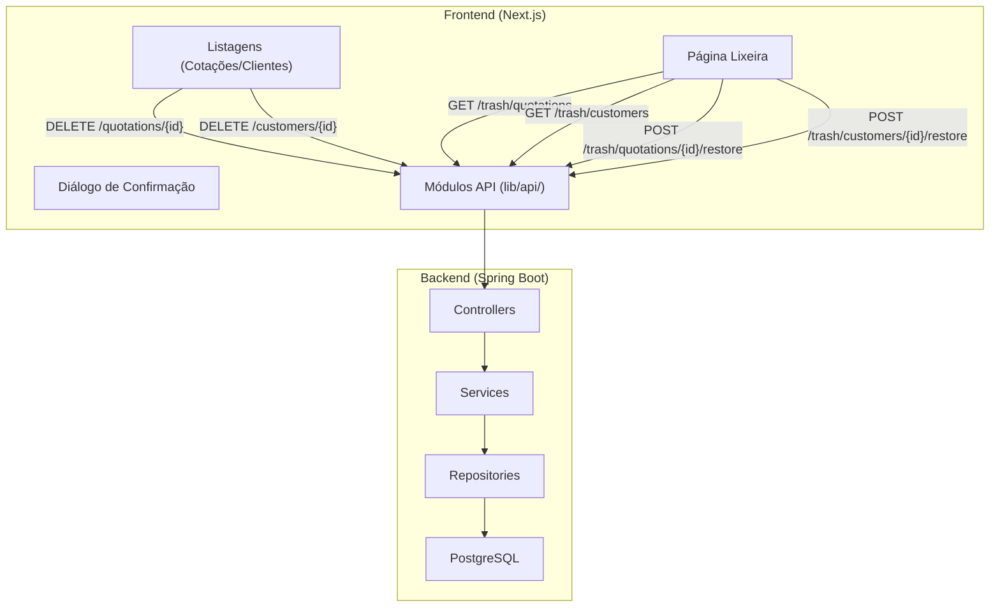
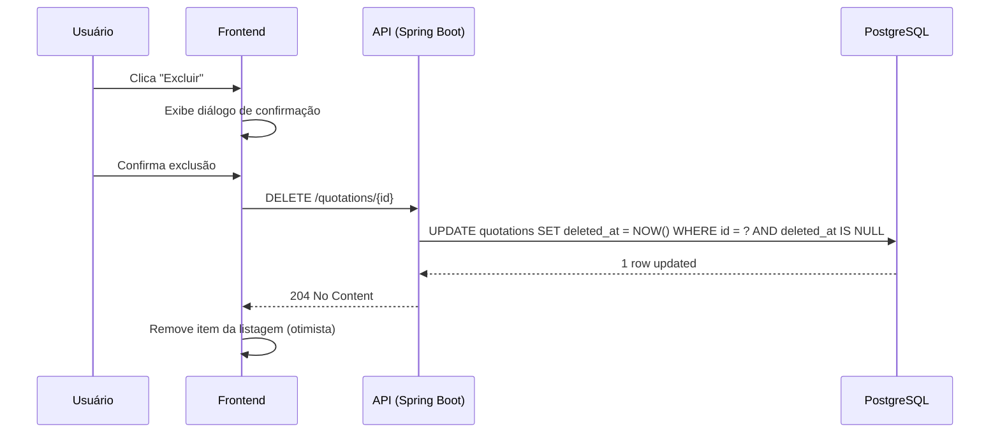
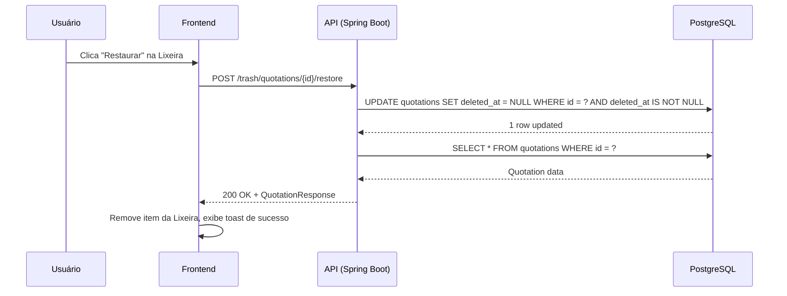
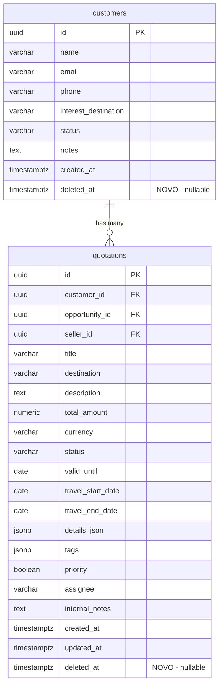

# Design — Soft Delete

## Visão Geral

Esta funcionalidade implementa a exclusão lógica (soft delete) para as entidades **Quotation** e **Customer** no AgenciaHub. Em vez de remover registros permanentemente do banco de dados, um campo `deleted_at` é preenchido com o timestamp da exclusão. Registros com `deleted_at` preenchido são filtrados das listagens normais e ficam acessíveis apenas na seção "Lixeira", onde podem ser restaurados.

### Decisões de Design

| Decisão | Justificativa |
|---------|---------------|
| Campo `deleted_at` nullable em vez de flag booleano | Permite rastrear *quando* a exclusão ocorreu, útil para auditoria e ordenação na Lixeira |
| Sem cascata na exclusão de Cliente | Cotações associadas permanecem ativas — evita perda acidental de dados de negócio |
| Filtro via `@Where` do Hibernate + queries explícitas | Garante que nenhuma query existente retorne registros excluídos sem refatoração manual de cada uma |
| Nova migration Flyway (V8) | Respeita a regra de nunca editar migrations existentes já no main |
| Endpoints REST dedicados para trash/restore | Separação clara entre operações normais e operações de lixeira |

---

## Arquitetura



### Fluxo de Soft Delete



### Fluxo de Restauração



---

## Componentes e Interfaces

### Backend

#### Migration (V8)

**Arquivo:** `src/main/resources/db/migration/V8__soft_delete.sql`

```sql
-- Adiciona campo deleted_at nas tabelas quotations e customers
ALTER TABLE quotations ADD COLUMN deleted_at TIMESTAMP WITH TIME ZONE;
ALTER TABLE customers ADD COLUMN deleted_at TIMESTAMP WITH TIME ZONE;

-- Índices parciais para queries de listagem (registros ativos)
CREATE INDEX idx_quotations_active ON quotations (created_at DESC) WHERE deleted_at IS NULL;
CREATE INDEX idx_customers_active ON customers (created_at DESC) WHERE deleted_at IS NULL;

-- Índices parciais para queries da lixeira (registros excluídos)
CREATE INDEX idx_quotations_deleted ON quotations (deleted_at DESC) WHERE deleted_at IS NOT NULL;
CREATE INDEX idx_customers_deleted ON customers (deleted_at DESC) WHERE deleted_at IS NOT NULL;
```

#### Entidades (alterações)

**Customer.java** — adicionar campo:
```java
@Column(name = "deleted_at")
private Instant deletedAt;
```

**Quotation.java** — adicionar campo:
```java
@Column(name = "deleted_at")
private Instant deletedAt;
```

#### Repositories (novos métodos)

**QuotationRepository.java:**
```java
// Listagem ativa (deleted_at IS NULL)
@Query("SELECT q FROM Quotation q WHERE q.deletedAt IS NULL ORDER BY q.createdAt DESC")
List<Quotation> findAllActive();

// Listagem da lixeira (deleted_at IS NOT NULL)
@Query("SELECT q FROM Quotation q WHERE q.deletedAt IS NOT NULL ORDER BY q.deletedAt DESC")
List<Quotation> findAllDeleted();

// Busca por ID apenas se ativo
@Query("SELECT q FROM Quotation q WHERE q.id = :id AND q.deletedAt IS NULL")
Optional<Quotation> findActiveById(@Param("id") UUID id);

// Busca por ID apenas se excluído
@Query("SELECT q FROM Quotation q WHERE q.id = :id AND q.deletedAt IS NOT NULL")
Optional<Quotation> findDeletedById(@Param("id") UUID id);
```

**CustomerRepository.java:**
```java
// Listagem ativa (deleted_at IS NULL)
List<Customer> findByDeletedAtIsNullOrderByCreatedAtDesc();

// Listagem da lixeira
List<Customer> findByDeletedAtIsNotNullOrderByDeletedAtDesc();

// Busca por ID apenas se ativo
Optional<Customer> findByIdAndDeletedAtIsNull(UUID id);

// Busca por ID apenas se excluído
Optional<Customer> findByIdAndDeletedAtIsNotNull(UUID id);

// Buscas filtradas (ativas)
List<Customer> findByDeletedAtIsNullAndNameContainingIgnoreCaseOrderByCreatedAtDesc(String name);
List<Customer> findByDeletedAtIsNullAndStatusOrderByCreatedAtDesc(CustomerStatus status);
List<Customer> findByDeletedAtIsNullAndNameContainingIgnoreCaseAndStatusOrderByCreatedAtDesc(String name, CustomerStatus status);
```

#### Services (novos métodos)

**QuotationService.java** — adicionar:
```java
@Transactional
public void softDelete(UUID id) {
    Quotation entity = quotationRepository.findActiveById(id)
        .orElseThrow(() -> new ResourceNotFoundException("Cotação não encontrada: " + id));
    entity.setDeletedAt(Instant.now());
}

@Transactional
public QuotationResponse restore(UUID id) {
    Quotation entity = quotationRepository.findDeletedById(id)
        .orElseThrow(() -> new ResourceNotFoundException("Cotação não encontrada na lixeira: " + id));
    entity.setDeletedAt(null);
    return toResponse(entity);
}

@Transactional(readOnly = true)
public List<QuotationResponse> listDeleted() {
    return quotationRepository.findAllDeleted().stream()
        .map(this::toResponse).toList();
}
```

**CustomerService.java** — adicionar:
```java
@Transactional
public void softDelete(UUID id) {
    Customer entity = customerRepository.findByIdAndDeletedAtIsNull(id)
        .orElseThrow(() -> new ResourceNotFoundException("Cliente não encontrado: " + id));
    entity.setDeletedAt(Instant.now());
    // NÃO faz cascata nas cotações
}

@Transactional
public CustomerResponse restore(UUID id) {
    Customer entity = customerRepository.findByIdAndDeletedAtIsNotNull(id)
        .orElseThrow(() -> new ResourceNotFoundException("Cliente não encontrado na lixeira: " + id));
    entity.setDeletedAt(null);
    return toResponse(entity);
}

@Transactional(readOnly = true)
public List<CustomerResponse> listDeleted() {
    return customerRepository.findByDeletedAtIsNotNullOrderByDeletedAtDesc().stream()
        .map(this::toResponse).toList();
}
```

#### Controllers (novos endpoints)

**QuotationController.java** — adicionar:
```java
@DeleteMapping("/{id}")
@ResponseStatus(HttpStatus.NO_CONTENT)
@Operation(summary = "Soft-delete a quotation")
public void delete(@PathVariable UUID id) {
    quotationService.softDelete(id);
}
```

**CustomerController.java** — adicionar:
```java
@DeleteMapping("/{id}")
@ResponseStatus(HttpStatus.NO_CONTENT)
@Operation(summary = "Soft-delete a customer")
public void delete(@PathVariable UUID id) {
    customerService.softDelete(id);
}
```

**TrashController.java** (novo):
```java
@RestController
@RequestMapping("/trash")
@RequiredArgsConstructor
@Tag(name = "Trash")
public class TrashController {

    private final QuotationService quotationService;
    private final CustomerService customerService;

    @GetMapping("/quotations")
    @Operation(summary = "List soft-deleted quotations")
    public List<QuotationResponse> listDeletedQuotations() {
        return quotationService.listDeleted();
    }

    @GetMapping("/customers")
    @Operation(summary = "List soft-deleted customers")
    public List<CustomerResponse> listDeletedCustomers() {
        return customerService.listDeleted();
    }

    @PostMapping("/quotations/{id}/restore")
    @Operation(summary = "Restore a soft-deleted quotation")
    public QuotationResponse restoreQuotation(@PathVariable UUID id) {
        return quotationService.restore(id);
    }

    @PostMapping("/customers/{id}/restore")
    @Operation(summary = "Restore a soft-deleted customer")
    public CustomerResponse restoreCustomer(@PathVariable UUID id) {
        return customerService.restore(id);
    }
}
```

#### Alterações nas Queries Existentes

O `QuotationService.search()` precisa adicionar um predicado `deletedAt IS NULL` na `Specification`:

```java
// Dentro de quotationSearchSpec:
predicates.add(cb.isNull(root.get("deletedAt")));
```

O `CustomerService.search()` precisa trocar os métodos do repository para usar as versões filtradas por `deletedAt IS NULL`.

O `SellerDashboardController` já usa `QuotationService.search()`, então herdará o filtro automaticamente.

---

### Frontend

#### Novos Módulos API

**`src/lib/api/soft-delete-remote.ts`:**
```typescript
export async function softDeleteQuotation(id: string, token: string): Promise<void>;
export async function softDeleteCustomer(id: string, token: string): Promise<void>;
export async function listDeletedQuotations(token: string): Promise<QuotationResponse[]>;
export async function listDeletedCustomers(token: string): Promise<CustomerResponse[]>;
export async function restoreQuotation(id: string, token: string): Promise<QuotationResponse>;
export async function restoreCustomer(id: string, token: string): Promise<CustomerResponse>;
```

#### Nova Página — Lixeira

**Rota:** `/lixeira` → `src/app/(app)/lixeira/page.tsx`

Componentes:
- Abas para alternar entre "Cotações" e "Clientes"
- Lista de itens excluídos com informações principais + data de exclusão
- Botão "Restaurar" em cada item
- Toast de sucesso/erro após ações

#### Componente de Diálogo de Confirmação

**`src/components/ui/confirm-dialog.tsx`:**
- Modal reutilizável com título, mensagem, botões "Cancelar" e "Confirmar"
- Usado nas listagens de cotações e clientes ao clicar em "Excluir"

#### Alterações na Navegação

**`src/components/layout/dashboard-shell.tsx`:**
- Adicionar item "Lixeira" no grupo "Principal" do menu lateral (com ícone de lixeira)
- Visível para OWNER e SELLER

#### Alterações nas Listagens Existentes

**Cotações (`/cotacoes`):**
- Adicionar botão/ícone de exclusão em cada card do Kanban ou na listagem

**Clientes (`/clientes`):**
- Adicionar botão/ícone de exclusão em cada linha da listagem

---

## Modelos de Dados

### Alterações no Banco de Dados



### DTOs de Resposta (alterações)

**QuotationResponse** — adicionar campo:
```java
Instant deletedAt
```

**CustomerResponse** — adicionar campo:
```java
Instant deletedAt
```

### Contratos da API REST

| Método | Endpoint | Descrição | Request Body | Response |
|--------|----------|-----------|--------------|----------|
| DELETE | `/quotations/{id}` | Soft-delete cotação | — | 204 No Content |
| DELETE | `/customers/{id}` | Soft-delete cliente | — | 204 No Content |
| GET | `/trash/quotations` | Listar cotações excluídas | — | 200 + `QuotationResponse[]` |
| GET | `/trash/customers` | Listar clientes excluídos | — | 200 + `CustomerResponse[]` |
| POST | `/trash/quotations/{id}/restore` | Restaurar cotação | — | 200 + `QuotationResponse` |
| POST | `/trash/customers/{id}/restore` | Restaurar cliente | — | 200 + `CustomerResponse` |

---

## Propriedades de Corretude

*Uma propriedade é uma característica ou comportamento que deve ser verdadeiro em todas as execuções válidas de um sistema — essencialmente, uma declaração formal sobre o que o sistema deve fazer. Propriedades servem como ponte entre especificações legíveis por humanos e garantias de corretude verificáveis por máquina.*

### Property 1: Soft-delete define timestamp e preserva dados

*Para qualquer* entidade ativa (Quotation ou Customer) com quaisquer dados, ao executar o soft-delete, o campo `deletedAt` deve ser preenchido com um timestamp não-nulo, e todos os demais campos do registro devem permanecer inalterados.

**Validates: Requirements 2.1, 2.5, 3.1, 3.5**

### Property 2: Exclusão de cliente não cascateia para cotações

*Para qualquer* Customer com uma ou mais Quotations associadas, ao executar o soft-delete do Customer, todas as Quotations associadas devem manter seu campo `deletedAt` inalterado (permanecendo `NULL` se estavam ativas).

**Validates: Requirements 3.6**

### Property 3: Listagens ativas excluem registros deletados

*Para qualquer* conjunto de registros (Quotations ou Customers) onde alguns possuem `deletedAt` preenchido e outros possuem `deletedAt` nulo, a consulta de listagem ativa deve retornar exclusivamente os registros com `deletedAt` nulo.

**Validates: Requirements 4.1, 4.2, 4.4, 4.5**

### Property 4: Lixeira retorna apenas registros deletados

*Para qualquer* conjunto de registros (Quotations ou Customers) onde alguns possuem `deletedAt` preenchido e outros possuem `deletedAt` nulo, a consulta da lixeira deve retornar exclusivamente os registros com `deletedAt` não-nulo, ordenados por `deletedAt` decrescente.

**Validates: Requirements 5.1, 5.2, 5.6**

### Property 5: Round-trip soft-delete/restore preserva dados

*Para qualquer* entidade ativa (Quotation ou Customer) com quaisquer dados, executar soft-delete seguido de restore deve resultar em um registro com `deletedAt` nulo e todos os demais campos idênticos ao estado original antes da exclusão.

**Validates: Requirements 6.1, 6.2, 6.6**

### Property 6: Entidades criadas possuem deletedAt nulo

*Para qualquer* payload válido de criação de Quotation ou Customer, o registro resultante deve ter o campo `deletedAt` igual a `NULL`.

**Validates: Requirements 1.2**

---

## Tratamento de Erros

| Cenário | HTTP Status | Código | Mensagem |
|---------|-------------|--------|----------|
| Soft-delete de registro inexistente | 404 | NOT_FOUND | "Cotação não encontrada: {id}" / "Cliente não encontrado: {id}" |
| Soft-delete de registro já excluído | 404 | NOT_FOUND | "Cotação não encontrada: {id}" / "Cliente não encontrado: {id}" |
| Restore de registro inexistente | 404 | NOT_FOUND | "Cotação não encontrada na lixeira: {id}" / "Cliente não encontrado na lixeira: {id}" |
| Restore de registro ativo (não excluído) | 404 | NOT_FOUND | "Cotação não encontrada na lixeira: {id}" / "Cliente não encontrado na lixeira: {id}" |
| Falha de rede no frontend | — | — | Toast: "Erro ao excluir. Tente novamente." / "Erro ao restaurar. Tente novamente." |

O tratamento de erros segue o padrão existente via `GlobalExceptionHandler` e `ResourceNotFoundException`. Nenhuma nova exceção customizada é necessária.

---

## Estratégia de Testes

### Testes de Unidade (Backend)

- **QuotationService**: testar `softDelete()`, `restore()`, `listDeleted()` com mocks do repository
- **CustomerService**: testar `softDelete()`, `restore()`, `listDeleted()` com mocks do repository
- Verificar que `softDelete` lança `ResourceNotFoundException` para IDs inexistentes ou já excluídos
- Verificar que `restore` lança `ResourceNotFoundException` para IDs inexistentes ou ativos
- Verificar que soft-delete de Customer não altera cotações associadas

### Testes Property-Based (Backend)

**Biblioteca:** [jqwik](https://jqwik.net/) (property-based testing para Java/JUnit 5)

**Configuração:** Mínimo 100 iterações por propriedade.

Cada teste deve ser anotado com um comentário referenciando a propriedade do design:
```
// Feature: soft-delete, Property {N}: {título}
```

**Propriedades a implementar:**
1. Soft-delete define timestamp e preserva dados
2. Exclusão de cliente não cascateia para cotações
3. Listagens ativas excluem registros deletados
4. Lixeira retorna apenas registros deletados
5. Round-trip soft-delete/restore preserva dados
6. Entidades criadas possuem deletedAt nulo

### Testes de Integração (Backend)

- Testar endpoints REST completos (controller → service → repository → H2)
- Verificar status codes (204, 200, 404)
- Verificar que o SellerDashboard não conta registros excluídos
- Verificar que `GET /quotations/{id}` retorna 404 para registros excluídos

### Testes de Frontend

- **Unitários**: Verificar que o diálogo de confirmação aparece ao clicar em excluir
- **Unitários**: Verificar que a página da Lixeira renderiza abas e itens corretamente
- **Integração**: Verificar chamadas à API com mocks (soft-delete, restore, listagem da lixeira)
- **Unitários**: Verificar que o link "Lixeira" aparece no menu lateral
